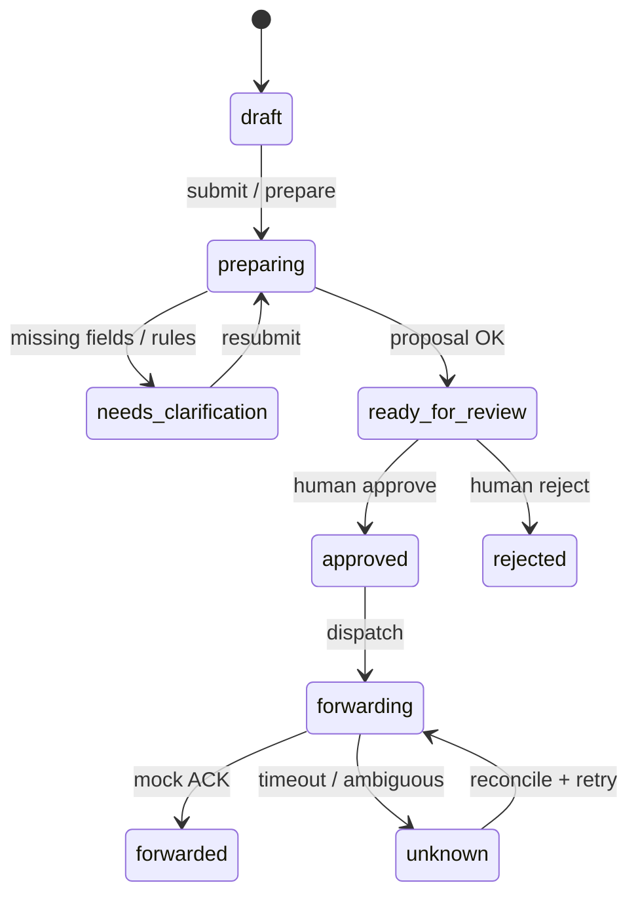

# SoteOps Agent

Independent Finnish-language **portfolio prototype**. It prepares synthetic access requests for human review and, after approval, forwards a structured proposal to a **mock** downstream system.

**Not production-ready. Not clinically validated. Not affiliated with Päijät-Hämeen hyvinvointialue or any real organization.** All employees, systems, and policies are synthetic.

## Problem hypothesis (unvalidated)

Public-sector access workflows often fail late because requests are incomplete, conflict with policy, or lack supporting evidence. This prototype tests whether bounded AI preparation—field extraction, deterministic rules, retrieval with citations—can surface those issues **before** a human reviewer decides, potentially reducing corrections and rework. **No time savings are claimed without the manual protocol in [`docs/evaluation.md`](docs/evaluation.md).**

## Architecture

```text
Browser (Next.js, fi)
    → FastAPI monolith (:8000)
        → PostgreSQL + pgvector (:5432)
        → mock-integration (:8001)
        → optional local Ollama (manual, not CI)
```

### Request state (simplified)



Details: [`docs/architecture.md`](docs/architecture.md). Security review: [`docs/security-review.md`](docs/security-review.md). Azure OpenAI adapter (mocked tests only): [`docs/azure-openai.md`](docs/azure-openai.md).

## Local setup

### Docker Compose (recommended demo)

```bash
docker compose up --build
# Frontend: http://127.0.0.1:3000
# API:      http://127.0.0.1:8000/health
```

### Manual stack

See [`docs/setup.md`](docs/setup.md). Summary:

```bash
uv sync --locked --all-packages --group dev
cd backend && uv run alembic upgrade head && uv run soteops-seed && cd ..
# Start mock (:8001), API (:8000), then:
cd frontend && npm ci && npm run dev
```

Demo logins (passwords in `seed/identities.json`):

| Role | Email |
| --- | --- |
| Requester | `aino.esimerkki@demo.invalid` |
| Reviewer | `ville.valvoja@demo.invalid` |
| Operator | `outi.operaattori@demo.invalid` |

## Test and evaluation commands

```bash
# Backend (needs Postgres on localhost:5432)
uv run ruff check backend mock-integration
uv run mypy backend/app mock-integration/mock_integration
uv run pytest --cov

# Held-out synthetic evaluation (fake provider)
uv run pytest backend/tests/test_evaluation.py -q
uv run soteops-eval --split held_out

# Frontend
cd frontend && npm run lint && npm run typecheck && npm run build
cd frontend && npm run test:e2e   # requires full stack
```

Evaluation methodology and manual time-study protocol: [`docs/evaluation.md`](docs/evaluation.md).

Latest fake-provider held-out report (generated by pytest when Postgres available): [`docs/results/evaluation-held-out-fake.md`](docs/results/evaluation-held-out-fake.md).

**Real Ollama model evaluation:** not run in CI; no committed real-model numbers.

## Portfolio demo (3–5 min)

Script: [`docs/demo-script.md`](docs/demo-script.md). Must include:

1. **Success path** — complete request → review → approve → mock forward (idempotent).
2. **Clarification** — missing fields → `needs_clarification`, not auto-approved.
3. **Timeout reconciliation** — `unknown` after lost response → retry finds same mock record.

## Measured results (fake provider, held-out split)

Run `uv run pytest backend/tests/test_evaluation.py` to regenerate. Metrics cover 15 held-out cases; control checks reference 13 dedicated security/forwarding pytest scenarios.

| Metric | Source |
| --- | --- |
| Field extraction, missing-field P/R, retrieval@k, citations, routing | `test_evaluation.py` |
| Approval boundary, duplicate submission | `test_access_requests.py`, `test_forwarding.py` |
| Latency p50/p95 | Per-case timing in evaluation runner |

See committed JSON/Markdown under `docs/results/` after a successful test run. Limitations are listed in each report.

## Feature status

| Feature | Status |
| --- | --- |
| Synthetic seed data + Finnish UI | **Implemented** |
| Local demo auth (session + CSRF) | **Implemented** |
| LangGraph preparation (6 nodes) | **Implemented** |
| Deterministic policy rules | **Implemented** |
| pgvector retrieval + citation check | **Implemented** |
| Human approval with proposal hash binding | **Implemented** |
| Mock forwarding + idempotency outbox | **Implemented** |
| 35-case evaluation corpus + held-out gate | **Implemented** |
| Playwright E2E (fake AI) | **Implemented** |
| CI: lint, test, e2e, pip-audit, secret scan | **Implemented** |
| Fake LLM/embeddings in CI | **Simulated** (deterministic, not model quality) |
| Azure OpenAI adapter (httpx) | **Implemented**; **tested with mocked Azure responses**; **not live-verified** |
| Optional local Ollama | **Unverified** in automated eval |
| Real Entra ID / IAM provisioning | **Future / out of scope** |
| Validated operational time savings | **Unverified** (manual protocol only) |
| Cloud deploy / paid APIs | **Not authorized** in this repo |

## Repository map

| Path | Purpose |
| --- | --- |
| [`AGENTS.md`](AGENTS.md) | Agent and product constraints |
| [`docs/implementation-plan.md`](docs/implementation-plan.md) | Build plan and slice status |
| [`seed/evaluation/`](seed/evaluation/) | Labelled synthetic evaluation cases |
| [`backend/`](backend/) | FastAPI, workflow, evaluation harness |
| [`frontend/`](frontend/) | Next.js UI + Playwright |
| [`mock-integration/`](mock-integration/) | Idempotent mock receiver |

## Constraints

Read [`AGENTS.md`](AGENTS.md) before contributing. Do not introduce real patient or employee data, production IAM, or claims of validated clinical or operational impact.
