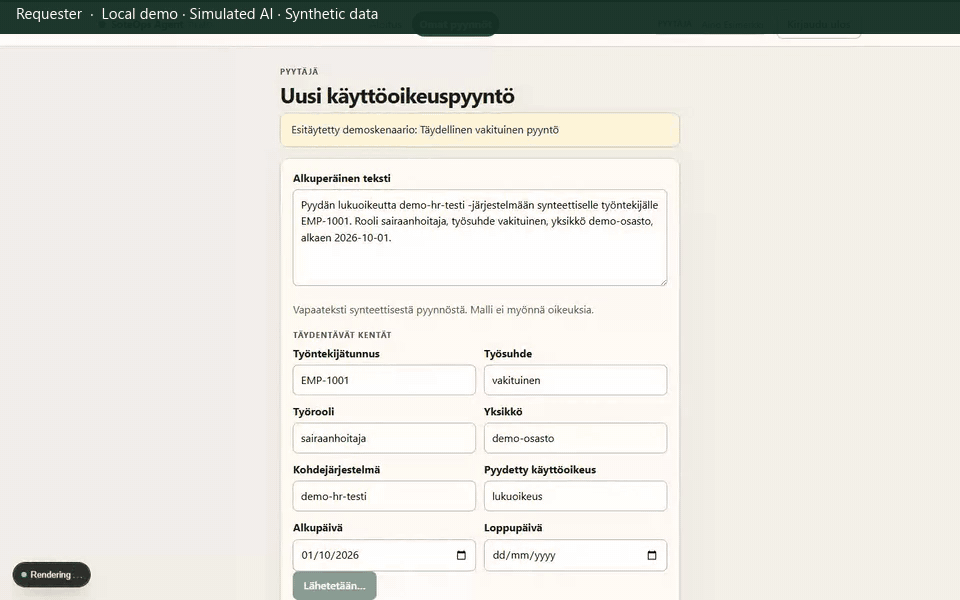

# 1. Successful request

Show a complete synthetic request going through preparation, **human** approval of the exact proposal, and mock receipt. The mock stores a request record. It does not create an account.

**Persona and start:** Requester `aino.esimerkki@demo.invalid` opens **Täydellinen vakituinen pyyntö** (`/requests/new?scenario=complete-permanent`: `EMP-1001`, `lukuoikeus`, `demo-hr-testi`). Reviewer `ville.valvoja@demo.invalid` approves. A requester session cannot approve.

[Static poster](media/01-successful-request-poster.png)

## What the GIF shows

1. The requester submits **Lähetä valmisteltavaksi**. Status becomes **Odottaa tarkastusta**.
2. The reviewer opens the case, starts **Aloita tarkastus**, and sees **Ehdotus kelpaa hyväksyntään nykyisten sääntöjen mukaan.**
3. The reviewer clicks **Hyväksy tarkka ehdotus**.
4. **Lähetä / yritä uudelleen** (demo fault **Onnistuminen**) yields **Vastaanotettu**, a **Mock-tietue** id, and an idempotency key.
5. Overlay copy states mock receipt, not provisioning. The panel also says the mock does not create accounts or grant rights.

## What this recording demonstrates

A reviewer—not the model—approves a bound proposal snapshot. Downstream is a local mock that records the request. It is not IAM provisioning.

## Automated checks (not only the GIF)

- Playwright: [`frontend/e2e/happy-path.spec.ts`](../../frontend/e2e/happy-path.spec.ts) (`requester submit → reviewer approve → forward shows mock record`)
- pytest: [`test_reviewer_queue_and_happy_path_approve`](../../backend/tests/test_access_requests.py)
- pytest: [`test_successful_forward_creates_one_mock_record`](../../backend/tests/test_forwarding.py) — mock lookup `stores_accounts` is false
- Recording capture also asserts one additional mock record and `stores_accounts=false`

## Limitations

Waiting periods are shortened. Fake LLM/embeddings were used. This is not a real downstream system.

## Implementation

- Fixture: [`frontend/src/lib/demo-scenarios.ts`](../../frontend/src/lib/demo-scenarios.ts) (`complete-permanent`)
- Approval binding: [`backend/app/services/approvals.py`](../../backend/app/services/approvals.py)
- Mock copy: [`frontend/src/components/SubmissionPanel.tsx`](../../frontend/src/components/SubmissionPanel.tsx)
- Mock store: [`mock-integration/mock_integration/store.py`](../../mock-integration/mock_integration/store.py)
- Policy: [`seed/policy/v1.json`](../../seed/policy/v1.json)

[Walkthrough overview](README.md) · Next: [Missing end date](02-missing-end-date.md)
