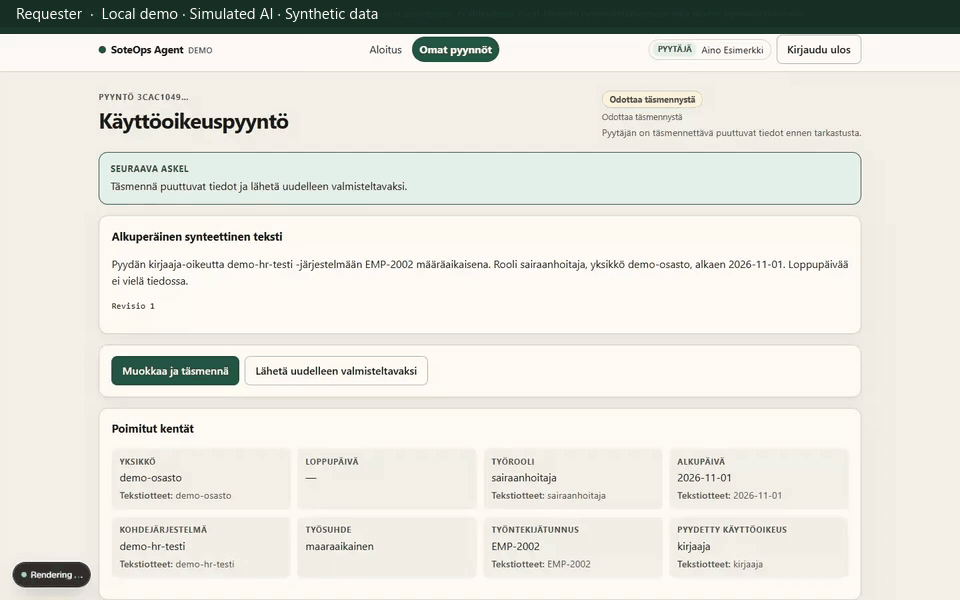

# 2. Missing end date

**Status:** supported and recorded. Local capture, fake providers, installed Chrome.

**Caption:** Clarification for a missing end date, requester correction (`Loppupäivä` 2026-12-31), then re-preparation with empty findings. This clip does not include reviewer approval. After re-preparation the status badge is scrolled off-screen; the filled date and “Ei puuttuvia kenttiä” are the visible outcome. Waiting periods are shortened; GIF duration is not measured application latency.

## What you would see

1. Requester starts **Määräaikainen ilman loppupäivää** (`/requests/new?scenario=temporary-missing-end`).
2. Status **Odottaa täsmennystä**. Findings: **Loppupäivä** and **Määräaikainen vaatii loppupäivän**.
3. **Muokkaa ja täsmennä**, set **Loppupäivä**, **Tallenna muutokset**.
4. New revision. If the date is present and no other rules fail, status becomes **Odottaa tarkastusta**.

The requester page does not show the reviewer eligibility card. There is no approve button here.

## Personas

Requester only for the core clip.

## Evidence

- Playwright: `frontend/e2e/demo-scenarios.spec.ts` (`temporary-missing-end`)
- pytest: `test_temporary_access_requires_end_date`, `test_resubmit_creates_new_revision`

Recording steps: [`recording-plan.md`](recording-plan.md) §2.
