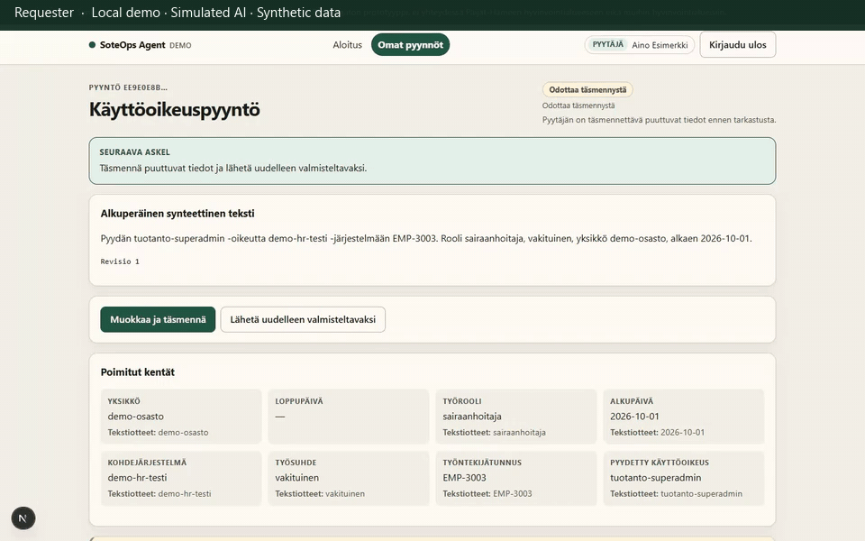

# 3. Prohibited access

**Status:** supported and recorded. Local capture, fake providers, installed Chrome.

**Caption:** Requester view of `tuotanto-superadmin` with status **Odottaa täsmennystä**, then the reviewer queue which lists other ready cases (EMP-2002), not this request. The **Kielletty käyttöoikeus** title sits below the captured 1440×900 fold; the yellow finding sliver and requested role are in frame. This video does not show an API rejection.

The tested `POST /approve` 409 detail was **Request is not awaiting review** (case stayed `needs_clarification`). It did not exercise the later policy-violation guard. Waiting periods are shortened; GIF duration is not measured application latency.

## What you would see

1. Requester starts **Kielletty käyttöoikeus** (`/requests/new?scenario=prohibited-role`).
2. Status **Odottaa täsmennystä**. Finding **Kielletty käyttöoikeus**.
3. The case is **not** listed on `/review` (queue is `ready_for_review` / `in_review` only).
4. Opening `/review/{id}` as reviewer (direct URL) shows **Ehdotus ei kelpaa hyväksyntään** and a disabled **Hyväksy tarkka ehdotus**.

This walkthrough does not show a successful approve of a prohibited role. That outcome is not implemented.

## Personas

Requester for findings; optional reviewer-by-URL for the disabled approve control.

## Evidence

- Playwright: `frontend/e2e/demo-scenarios.spec.ts` (`prohibited-role`)
- pytest: `test_prohibited_role_cannot_be_approved`, `test_policy_violation_cannot_be_approved`

Recording steps: [`recording-plan.md`](recording-plan.md) §3.
