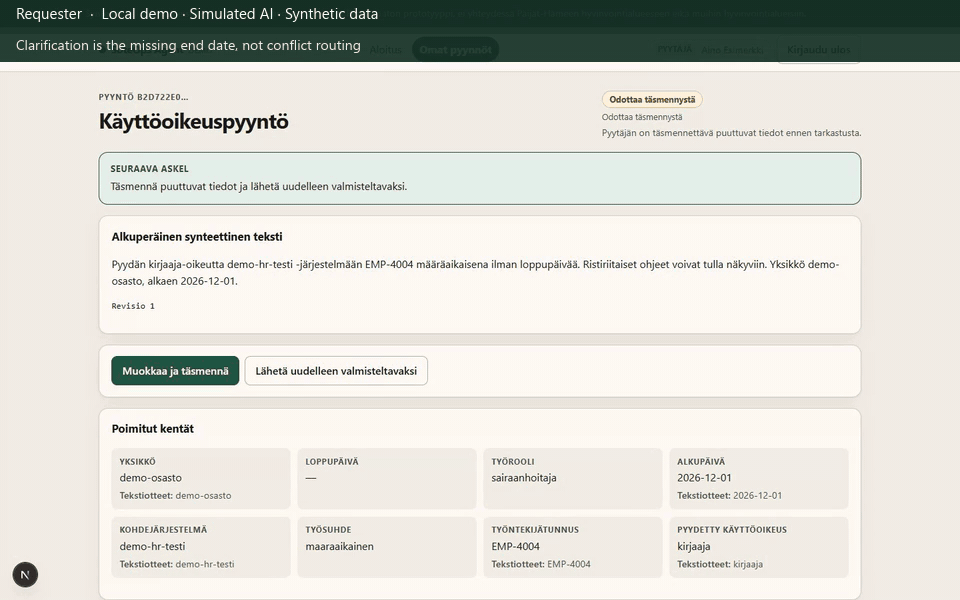

# 4. Conflicting instructions

**Status:** recorded from the local stack. **Recording configuration: `RETRIEVAL_TOP_K=8`** (both conflict documents were absent at the default 4).

**Caption:** Clarification was triggered by the missing end date, not by automatic conflict detection or conflict-based routing. Retrieved instructions remain evidence. **Ristiriita B** is in the captured viewport. **Ristiriita A** was asserted in the DOM during recording but scrolled out of frame; it is not fabricated here. Waiting periods are shortened; GIF duration is not measured application latency.

This fixture is also missing an end date, so the request status is **Odottaa täsmennystä**, not a special “conflict review” state. It does not appear on the reviewer queue.

## What you would see

1. Requester starts **Ristiriitaiset ohjeet** (`/requests/new?scenario=conflicting-instructions`).
2. Clarification findings for the missing end date.
3. **Ohjelähteet ja versiot** should include both:
   - Ristiriita A (`SYN-OHJE-RISTIRIITA-A-01-v1`)
   - Ristiriita B (`SYN-OHJE-RISTIRIITA-B-01-v1`)
4. Each card: *Ohje on näyttöä tarkastajalle, ei valtuutus.*

Recording used `RETRIEVAL_TOP_K=8` because both sources were missing at the default 4. Playwright asserted both document ids; the GIF viewport shows **Ristiriita B**. **Ristiriita A** is not fabricated.

## Personas

Requester. Optional reviewer-by-URL; not via `/review` queue.

## Evidence

- Playwright: `frontend/e2e/demo-scenarios.spec.ts` (`conflicting-instructions`) — status only
- pytest: `test_conflicting_current_instructions_are_both_retrieved`
- Eval case `eval-025` in `seed/evaluation/cases.json`

Recording steps: [`recording-plan.md`](recording-plan.md) §4.
