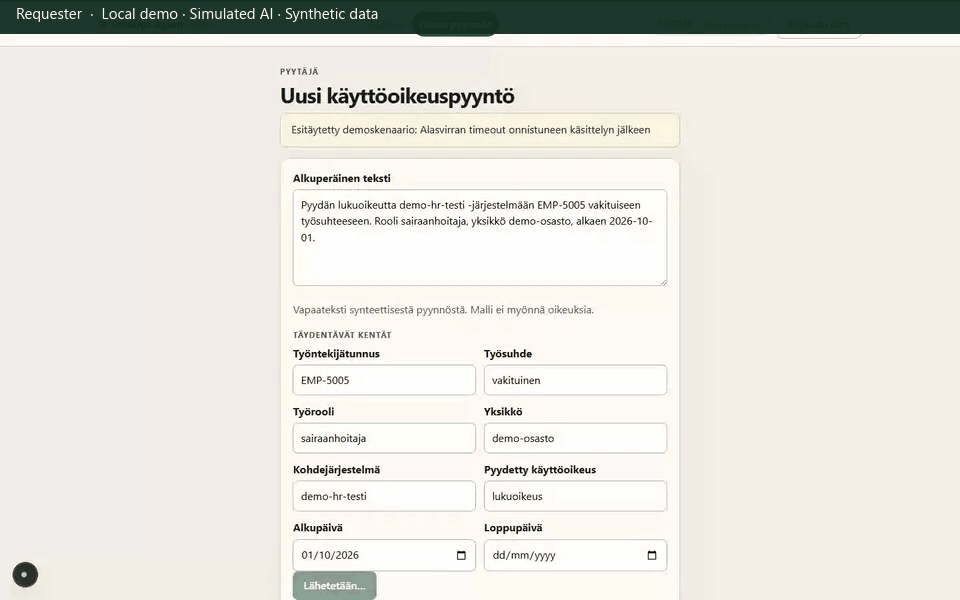

# 5. Lost-response reconciliation

**Status:** in-dispatch reconciliation recorded. A lingering **Tuntematon tulos** (`unknown`) screen is implemented in the backend but is **test-only** and is not in this GIF.

**Caption:** One-click outcome after **Kadonnut vastaus onnistuneen käsittelyn jälkeen**: **Vastaanotettu**, attempts 1, one mock record id. **Simulated lost response; automatic reconciliation.** No intermediate unknown screen and no manual retry. Exactly-one-record is a capture assertion (`GET` by idempotency key), not something established solely by the visible mock id. Waiting periods are shortened; GIF duration is not measured application latency.

Retries reuse `{request_id}:{payload_hash}`. The mock does not create a second record for the same key. After `accepted`, the UI disables further forward clicks.

## What you would see

1. Complete request from **Alasvirran timeout…** (`/requests/new?scenario=downstream-timeout`).
2. Reviewer approves, then selects `lost-response` and forwards.
3. Submission panel: **Vastaanotettu**, one **Mock-tietue**, one idempotency key.

This page does not show a screenshot of `unknown`. `test_stale_in_flight_is_recovered_as_unknown` covers that recovery without a demo control.

## Personas

Requester to create; reviewer (or operator) to forward. Operator cannot approve.

## Evidence

- Playwright: `frontend/e2e/demo-scenarios.spec.ts` (`downstream lost-response demo reconciles after forward`)
- pytest: `test_commit_then_timeout_is_reconciled`, `test_concurrent_dispatchers_do_not_duplicate`
- pytest (not UI): `test_stale_in_flight_is_recovered_as_unknown`

Recording steps: [`recording-plan.md`](recording-plan.md) §5.
