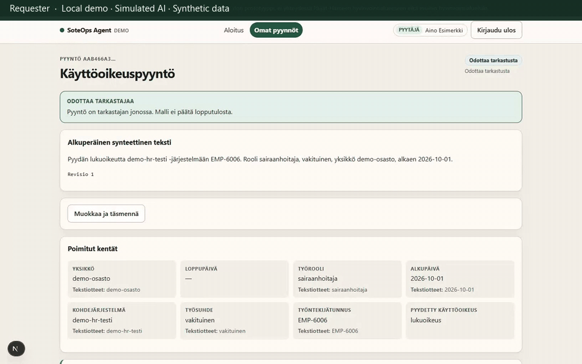

# 6. Stale proposal after edit

**Status:** recorded during review. Edit after approve is **locked**, not demonstrated.

**Caption:** Requester ready → reviewer opens the proposal (`Tarkastuksessa`) → requester edits while still in review → reviewer stale approve is rejected. **Stale proposal rejected during review.** The eligibility card on the stale page stays green because that tab was not refreshed; the visible failure is the `Stale proposal` error, not a successful approval. This is not an edit-after-approval path. Waiting periods are shortened; GIF duration is not measured application latency.

After a valid approve, a `pending` submission is created immediately. The requester cannot edit `approved`, `forwarding`, or `forwarded` cases, or any case whose submission is `pending` / `in_flight` / `unknown`. This walkthrough does not bypass that lock.

## What you would see

1. Requester starts **Hyväksynnän ohitusyritys** (`/requests/new?scenario=approval-bypass`).
2. Reviewer starts review on `/review/{id}` and leaves the page open.
3. Requester **Muokkaa ja täsmennä**, saves new text. Invalidation notice appears.
4. Reviewer clicks **Hyväksy tarkka ehdotus** on the stale page. `review-error` shows a stale/409 message. Status does not become **Hyväksytty**.

## Personas

Requester and reviewer in two browser sessions.

## Evidence

- Playwright: `frontend/e2e/stale-approve.spec.ts`
- pytest: `test_edit_invalidates_previous_proposal_and_stale_approval`
- pytest (lock after approve): `test_pending_submission_blocks_edits`

Recording steps: [`recording-plan.md`](recording-plan.md) §6.
